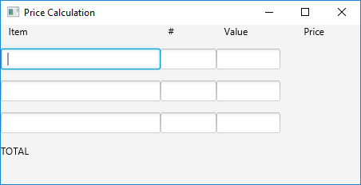

### COMPX202 -  Mobile Computing and Software Architecture
Assignment 2 - Experimenting with a big Java Package: JavaFX
========================================

#### Due on **Friday 20th March at 8pm**
 
The goal of this exercise is to experiment with the JavaFX system for building user interfaces.
JavaFX is the recommended library for making user interfaces in desktop applications with
the current version of the Java language and development system.

JavaFX is described in the documentation [here](https://openjfx.io/openjfx-docs/) (overview) and [here](https://openjfx.io/javadoc/11/) (full API).
You should also look at the explanations and resources in Week 3 materials.

This assignment has 3 parts:
 1. Taking a 'sample' program (different from the one examined in class) and experimenting to find out how it works.
 2. Extending or rewriting the sample program to layout a form in JavaFX.
 3. Adding callbacks to make your program interactive.

**You must update this README file and commit it in your repository as part of your work.**


Instructions
========

1. Fork this repository using the button at the top of the project page. KEEP THE VISIBILITY OF YOUR PROJECT PRIVATE. (Settings > expand Permissions > Project visibility: Private). Only your teachers should see your code, YOU CANNOT SHARE IT WITH YOUR CLASSMATES.
2. Clone the new repository to your computer using IntelliJ IDEA ( File > New > Project from Version Control ; insert the URL you get from YOUR repository by clicking "clone or download").  
3. Develop and test the program on your computer
as described below.
4. Remember to commit and push regularly as you work on the project!  Good Git usage, with regular commits having useful messages, will be required in the grading. You can use IntelliJ to commit and push your files (VCS > Git > ...). For more information see [https://www.jetbrains.com/help/idea/commit-and-push-changes.html](https://www.jetbrains.com/help/idea/commit-and-push-changes.html)
5. There are questions asked for each task and locations for answering each question in this document (after the task descriptions).  You should answer them in your copy of this document, which will be the README for your version of the project.


Task 1
======

1. The project includes a sample JavaFX program - called A2.java  (inside "src" folder). Make sure that your clone of the repository includes A2.java.  Try compiling and running it, to use IntelliJ IDEA you need to follow the instructions to set up a JavaFX project.  Find out what the program does when you enter text into the text boxes. Answer Question 1 (below).
2. In the same way as demonstrated in the lecture, experiment with A2.java.  Make changes to the program.  Run it and see what effects your changes have. You should focus on features not seen in the lecture.  To demonstrate your work, answer Question 2.  Your experiments should be different from those tried in the lecture and should be distinct, not be minor variations on a theme.
3. Three new JavaFX classes used in A2.java are:  HBox, Text and TextField.  Question 3 asks you to describe them.

Task 1 Questions
----------------

```
Question 1
What does A2.java do when you enter text?

When I input good characters in Raw input, such as Charlie007, 
Charlie007 will appear at the bottom of the interface.
There are four situations: 

1.When I input the same character in Censored, such as C, 
C will disappear in the "Charlie007"  at the bottom of the interface, 
just show "harlie007".

2.When I input a char like "A" in Replacement, the "A" will insert
the "Chalice007" word by word —— ACAhAaAlAiAcAeA0A0A7A. 

3.If I input a char that is ASCII bigger than "A" or equal "A", except the char 
in "Charlie007", "A" will disappear, it will look back to "Charlie007".
 
4.If I input a char which is from "Charlie007", like C, and I input
"A" in Replacement, it will just replace the "C" —— "Aharlie007". So
it means Replacement will replace the char which is inputted in Censored.

Question 2
Describe three experiments you conducted on A2.java and in each case explain what you learned from the results.

1. I tried to change the BASELINE_LEFT to BASELINE_RIGHT, and then I found the "Raw input" and "Censored Vision" 
appearing at the right of the box. So I know the "BASELINE_xxx" methods will define the position of the content.
Besides I tried the top and bottom, but there are no such methods.

2. I tried to make the form more readible. So I found I can choose to use ".setStyle" mehtod of HBox to design. Something
just likes in html and css.

3. I tried to understand what can HBox and VBox do. So I found Hbox is a horizontal layout, VBox is a vertical layout.
if I want one line one input box, I need to set Hbox and getChild.add() to Hbox, so do as VBox. And I can set their various 
attributes to better display a box.


Question 3
For each of the classes HBox, Text and TextField briefly describe the purpose of the class (what graphical element is it? what do you use it for?).

Hbox: Used for horizon arrangement. I can set the distance between the control and the hbox 
edge by setting the padding property. You can set the distance between controls by setting 
the spacing property. You can set style to change the background color.

Text: Text is used for input. It reminds me what to do in each input box.

Text field: This is the input box which looks like a rectangle with a blue line around it. I can use it for user input.

```

Task 2
======

In this section you will extend the A2.java program to display a form that looks like this.



The idea is that the form allows a user to enter up to 3 items that might be purchased in a shop.  For each item the user can enter the name of the item, the number being purchased and the unit price(value).  In Task 3 it will be extended to continually update labels at the right to display total price for each item and at the bottom the total price for all items. Your task here is to decide on a layout using VBox and HBox.  A good solution will make use of font size and other parameters give a good appearance.  You can assume that none of the prices displayed are never greater than $999.


Task 2 Questions
----------------

```
Question 1.
*Insert a screenshot of your form with 3 items filled in (item, number and value for each).

```


Task 3
======

Using callbacks on key release for each text box: update your program to calculate item prices and final
totals.  (Update the display on every key entry to the program).  If values entered are not valid numbers,
don't display prices.


The screen shot shows the program with some data entered.


Task 3 Questions
----------------

```
Question 1.
What would happen if you used the key press event rather than the key release event.

When I use the key press event, the value in price will change after I click the next textfiled and input the value or press the enter.


Question 2.
Is the use of key release satisfactory?  Are there situations in which edits are not detected? (hint: try using the mouse)

No, it isn't satisfactory. When I use the right mouse button, I can change the value in the box, but the price cannot change at any time. 
Because it's not a keyboard event, it's a mouse event.

Question 3.
*Insert a screenshot of your form with 3 items and the final total calculated.

```


Submission
==========

Your finished project should be in your GitHub repository (don't forget to commit and push).  
You must also export your project to a ZIP folder and submit that through Blackboard.


Grading
=======

| Weighting | Allocated to |
|:----------:|------|
| 20% | Correct repository usage and settings |
| 20% | Task 1 questions and modifications |
| 30% | Task 2 code and screenshot |
| 30% | Task 3 code and questions |
